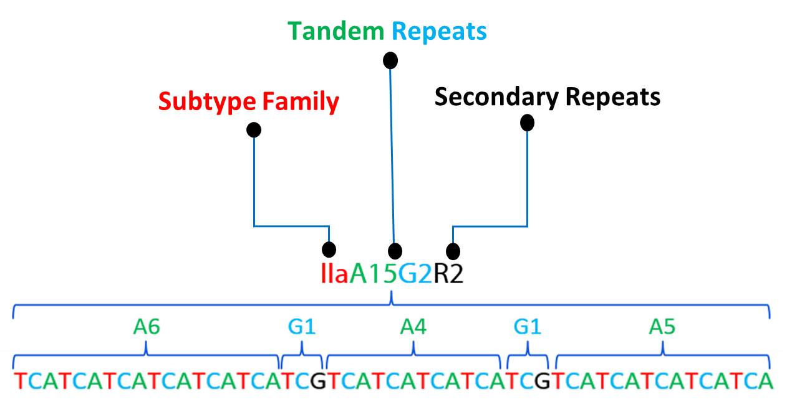
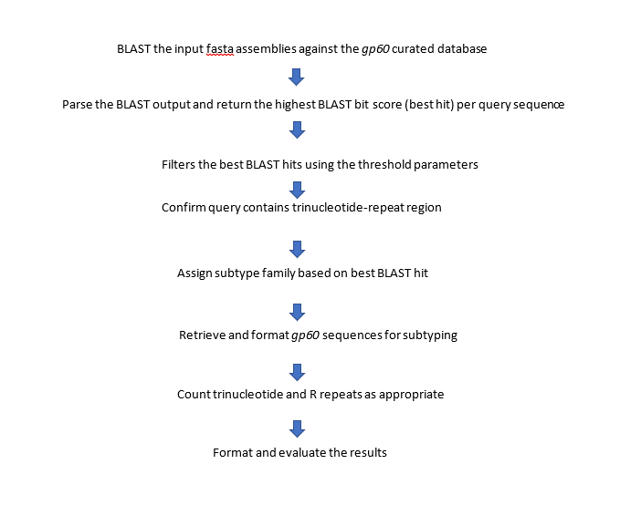

# Summary

Cryptosporidiosis is a gastrointestinal illness caused by the protozoan
parasite *Cryptosporidium*, for which there are nearly 20 species
reported to cause human infections. The parasite has a wide range of
transmission routes and vehicles, including person-to-person,
animal-to-person, water, and food. Though multiple individual protocols
comprise the standardized method for *Cryptosporidium* genotyping, there
are scant *gp60* marker-based tools for investigating the genetic
diversity of the *Cryptosporidium* species associated with human
infections, specifically *C. hominis* and *C. parvum* [@Alves:2003;@Alves:2006;@Cacciò:2005]. Given
their prevalence we developed the *gp60* tool to characterize *C.
hominis* and *C. parvum* subtypes and more rapidly respond to
cryptosporidiosis outbreak investigations and case surveillance.
Additionally, this tool can subtype other non-parvum and non-hominis
species.

# Statement of Need

Diarrheal diseases are one of the major causes of illness in children
and older adults globally. In 2016, diarrhea was the eighth leading
cause of death among all ages and fifth leading cause of death among
children younger than 5 years, according to the Global Burden of
Diseases, Injuries, and Risk Factors (GBD) Study [@gbd:2018].
*Cryptosporidium*, often referred to as 'Crypto,' is a zoonotic parasite
causing gastrointestinal and diarrheal illness called cryptosporidiosis
that can be attributed to diarrheal related deaths. It is one of the
leading causes of waterborne disease in the United States and accounts
for approximately 748,000 cases annually. Although there are 44
*Cryptosporidium* spp. and \>120 genotypes, *C. parvum* and *C. hominis*
cause \~95% of human infections [@gbd:2018;@Ryan:2021;@Chalmers:200]. Though the two species cause
the same illness, it is important to determine the species genetic
diversity and understand molecular epidemiological and geographical
distribution patterns for more efficient interventions. For these
reasons we developed the *gp60* tool to analyze and assign species and
subtypes. Regular integration and analysis of molecular characterization
and epidemiologic data can further elucidate *Cryptosporidium*
transmission patterns and cryptosporidiosis epidemiology.

The 60 kDa glycoprotein gene (*gp60*) is a commonly used marker that
characterizes *C. parvum* and *C. hominis* cases in cryptosporidiosis
outbreak and case surveillance. The *gp60* tool was developed because
not only subtyping a source to study genetic diversity but also
determines the importance for cryptosporidiosis molecular epidemiology
and as well the need for high-throughput, automated sequence analysis
methods[@Arias-Agudelo:2020;@Roellig:2020]. Using sequence data generated from *Cryptosporidium* specimens,
the tool assigns the species, subtype family, and subtype based on
sequence identity to reference sequences, short tandem repeats
(trinucleotide repeats), and secondary repeats. Nomenclature includes
subtype family (Ia, Ib, Id, Ie, If, Ig, etc. for *C. hominis* and IIa,
IIc, IId, IIe, IIf, IIg, IIh, IIi, etc. for *C. parvum*) followed by the
count of the trinucleotide repeats and the secondary repeats.

{width="3.8236122047244097in"
height="1.9819444444444445in"}

#### Figure 1: Pictorial representation of the subtype nomenclature. 
Nomenclature of the *C. parvum* IIaA15G2R2 subtype, which was designated as IIa subtype family, has 15 TCA (A15) and 2 TCG (G2) trinucleotide repeats, and 2 secondary repeats (R2) as mentioned in Table 1.

#### *Table 1:* Trinucleotide and secondary repeats present in the
*Cryptosporidium* *gp60* gene and associated designation for subtype
nomenclature.

  ---------------------------------- -------------------------
  |Trinucleotide repeat (5'→3') |   Subtype designation|
  | --- | --- |
  |TCA        |                        A
  | TCG       |                         G
  | TCT       |                         T
  | ACATCA     |                        R\*
  | AAA/G ACG GTG GTA AGG    |          R^¶^
  | C/AAG AA/G GGC A    |               R^+^
  ---------------------------------- -------------------------

\* Only within *C. parvum* subtype family IIa

^¶^ Only within *C. hominis* subtype family Ia

^+^ Only within *C. hominis* subtype family If

# Functionality

*gp60* tool is a workflow of various sub methods to allocate the subtype
nomenclature to the *Cryptosporidium* species. It utilizes the BLAST
tool and a *Cryptosporidium* specific curated database developed
in-house to align and filter the sequences. Initially, the tool checks
for all input parameters, tool requirements and then proceeds to begin
the analysis. The flow of the tool follows as below.

#### Figure 2. Functional workflow of the GP60 tool

We set threshold parameters to filter the best BLAST hit based on the
blast metrics results (i.e., coverage, identity, and query length). We
added an additional function known as non-conforming events (NCE) that
prints the NCE message in the results. These are assigned if there are
issues with the query sequences (Table 2). The tool generates the NCEs
based on the output of query sequence at each functional level and can
produce single or multiple NCEs depending on the overall output of the
query sequence.

#### *Table 2:* non-Conforming Events (NCE) and associated definitions

  -------------------------- --------------------------------------------------------------------------------------------------------------------
  | NCE                 |       Description |
  | --- | --- |
  | NCE-1\_noGp60              | No *gp60* sequence detected. |
  | NCE-2\_coverage            | Below coverage threshold (\<70%). | 
  | NCE-3\_identity            | Below percent identity threshold (\<97%). Check manually for subtype family and request to add to *gp60* database. |
  | NCE-4\_length              | Below length threshold (\<700bp). |
  | NCE-5\_startAtTriNuc       | Possible incomplete subtype: sequence starts at 5\' repeats. |
  | NCE-6\_missingTriNuc       | Sequence missing 5\' repeat region. |
  | NCE-7\_AmbiguityInTriNuc   | Incomplete subtype: ambiguous nucleotide(s) detected in 5\' repeat region. |
  -------------------------- --------------------------------------------------------------------------------------------------------------------

# Implementation

Our *gp60* tool is a simple and quick subtyping tool for
*Cryptosporidium* *gp60* sequence analysis. It can be used as a
standalone or integrated component within an existing analysis pipeline
for *Cryptosporidium*. The tool was developed using Perl and invoked
using a simple bash script on the Linux operating system. The only
requirements to run the tool are to ensure the operating system has
NCBI-BLAST tool and Perl scripting language is installed. To invoke the
tool on command line, it is mandatory to provide the path for input
sequences, *gp60* database, and specify sequence type for the tool to
analyze the data. The tool can process whole genome sequence (WGS)
assemblies as well as Sanger sequences that are in single or
multi-sequence fasta file format. Fasta files should not be compressed,
and multiple samples can be provided in the same file for Sanger
sequences. Also, we have containerized the *gp60* tool, and it is
available on the CDC GitHub Page:
<https://github.com/CDCgov/WDPB_CDS_PHL_Tools/tree/master/Crypto_GP60_Tool>

# Acknowledgements

This work was supported in part by the Advanced Molecular Detection
Program of the Centers for Disease Control and Prevention, Atlanta, GA.
The authors would like to thank M.H. Seabolt and L.S. Katz for testing
functionality of the tool.

## Additional Information and Declarations

The findings and conclusions in this manuscript are those of the authors
and do not necessarily represent the official position of the Centers
for Disease Control and Prevention.

# References
